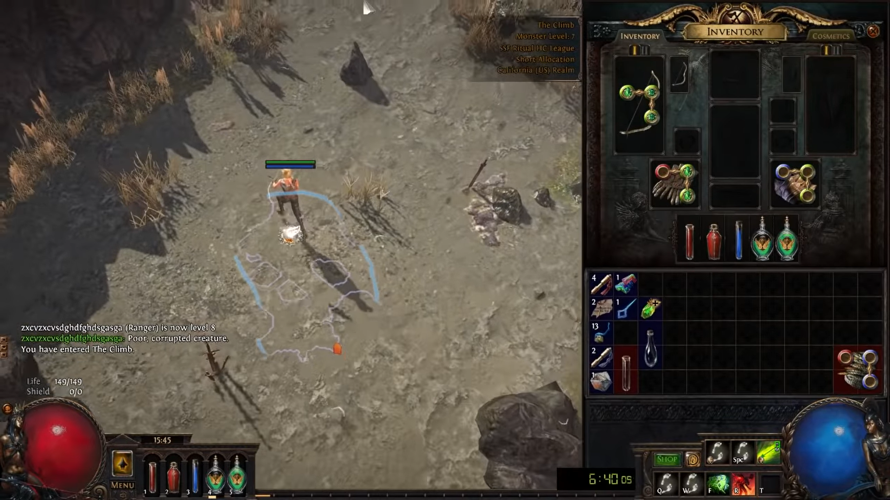

# Path of Exile Pather
## Overview
This is intended to be used as a way of seeing how well CNN can traverse generated terrarain. In Path of Exile each level has certain pattern or rules that the generation will always abide
by the question is can a CNN classify the direction to move in given the image input. Some of these generation patterns are very simple such as the next zone is always to a certain direction
while sometimes it has to do with inferering things such as roads going towards the exit. The extremes of this inferance gets to point of using the shadow the left foot of our character when
we enter the level. For now this model will only work on ACT 1 due to the linearality of it to serve as a good POC.
## Design
The design I will be using is a supervised learning approach using a CNN to try and predict the angle I should be currently traveling in.

## Train Data
To collect the data for this project it will be done with take screenshots every 25 seconds then manually labeling the angle that needs to be traveld in.

## Model

## Results

## Deployment
