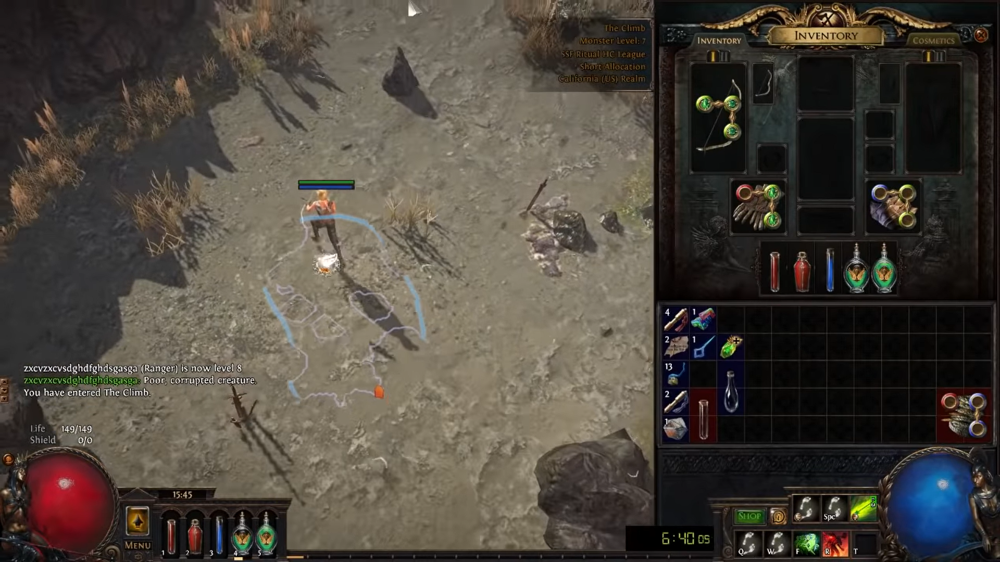

# Path of Exile Pather
## Overview
This is intended to be used as a way of seeing how well CNN can traverse generated terrain. In Path of Exile each level has certain pattern or rules that the generation will always abide
by the question is can a CNN classify the direction to move in given the image input. Some of these generation patterns are very simple such as the next zone is always to a certain direction
while sometimes it has to do with inferring things such as roads going towards the exit. The extremes of this inference gets to point of using the shadow the left foot of our character when
we enter the level. For now this model will only work on act 1 up to brutus due to the best route through the act being pretty shared between all builds unlike act 2.
## Deployment

## Design
The design I will be using is a supervised learning approach using a CNN to try and predict the angle I should be currently traveling in.

## Train Data
To collect the data for this project it will be done by taking screenshots every 25 seconds then manually labeling the angle that needs to be traveled in the data collected from various top racers in the community.

An example input into for the model would a image such as 

The model then should attempt to classify an angle to travel in. For the labeling of the data this was done manually.

## Model

## Evaluation

I believe the best way to evaluate the model is to see how accurate it is in each zone of the game. There are 9 zones total going up to where this and they have large varying complexity so I will explain the difficulties of each zone in terms of classification. Some have shared some similarities to each other and I will group them for this Evaluation.

### Type 1 Linear Path
  These zones just require running one direction hugging a wall to complete and I would expect the highest level of accuracy here.
### Type 2 Maze
  These have many branching paths and often confuse even some of the best players. There are some patterns to the generation but nothing concrete. I would expect the model to struggle here a bit since top racers sometimes do even.
### Type 3 Tidal Island
  This isn't a type but one specific zone in particular. This zone is actually the reason I started this project. Let me first explain the generation it always spawns a circle but the objective will always be 1/4 circle away in either direction. There is a discussion on whether to take the circle right or left and I wanted to see what a neural network would settle on. I am wondering if the model will choose to have a bias in one direction or will find a pattern racers could not. 

#### Results

